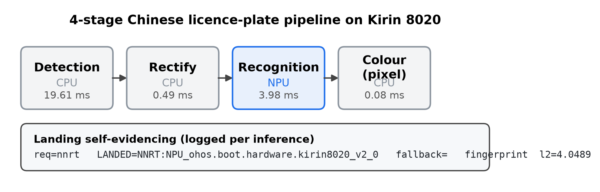

# 麒麟 8020 端侧异构推理：落点自证

**一个伪装成车牌识别 App 的测量仪器。**

[English](README.md) | [中文](README.zh-CN.md)

[](https://github.com/YangShusen2001/lpr-kirin8020-app/blob/main/tools/verify_published_numbers.py)
[](#)
[](paper/en/main.tex)

---

### 一句话

1. **要回答什么。** HarmonyOS **不暴露 NPU 利用率计数器** —— 所以落点靠
   `req=` / `LANDED=` / `fallback=` 日志协议 + 张量指纹来证明，**不由配置文件推定**。
2. **测出了什么。** 算子支持性是「**模型 × 工具链**」的属性而非硬件属性：
   NNRT 侧 36 个单独构图探针里 16 个被拒，CANN 侧 **51/51 全过**。换后端改变
   **0%** 输出，但配对检验显示它仍是显著变量（**+3.2 pp**，p < 0.0001）。
3. **落到了哪里。** 同一检测任务换架构：DFL 头**转换即失败**，原版 anchor-based
   YOLOv5 裁掉解码头后**真机落 NPU，7.79×**（同栈 CPU）。



---

## 这个仓库要回答的问题

在 HarmonyOS 上，关于一个已部署模型，有一个问题**无法靠测量回答**：

> 这次推理，真的跑在 NPU 上了吗？

NPU 利用率对应用侧不暴露、对设备调试 shell 不暴露、也没有任何厂商 profiling 模板；
唯一与 NPU 相关的计数器是**温度**，不是负载。与此同时落点是静默的——请求 NPU 的模型
可能被 CPU 服务而没有任何错误码；而**真的落在 NPU 上的模型，可能算出和 CPU 不同的答案**，
同样没有错误码。

所以本项目把它当作测量问题来做。每次推理都记录请求的后端、实际的后端、以及是否发生回落：

```
req=nnrt   LANDED=NNRT:NPU_ohos.boot.hardware.kirin8020_v2_0   fallback=
张量指纹  l2=4.0489
```

于是落点**从原始日志直接读出**，而不是由配置文件推定。
配置文件描述的是意图，**不是关于执行的证据**。

## 三条结论

**一、协议有效——包括它抓到了我们对它的过度声称。**
它捕获了一个在输出层不可见的纯预处理缺陷：一块 padding 区没有清零，导致上一次
不同内存布局的运行残留泄漏进识别器输入。输出层的症状是一个"看着像模像样"、
只少了一个字符的车牌串。张量指纹忠实记录了"有东西变了"——而只有把会话时间线对齐，
才看出变的是**我们这一侧**，不是加速器。我们最初声称指纹能证明**落点**；
实测证伪（三个模型的输出都声明为 FP32，按 fp16 重读在任何后端都是垃圾），协议随之重写。
见 [`docs/adr/0003`](docs/adr/0003-evidence-standard-latency-delta-and-landing.md)。

**二、算子支持性是「模型 × 工具链」的属性，不是硬件的属性。**
NNRT 通路上，36 个单算子探针有 16 个**单独构图时被拒**——包括 `ReLU`、`Sigmoid`、
`Softmax`、`MaxPool`、`Pad`、`Cast`、`Transpose`、`Resize`。照字面读，这等于说
这块加速器**连一个整流器都执行不了**。CANN 通路上，51/51 探针通过全部三关，
**包含 NNRT 侧被拒的那九个**。`ConvTranspose` 在 NNRT 侧**连模型都转换不出来**，
在 CANN 侧转换成功并跑通。同一份 ONNX，一侧产不出模型，另一侧能跑。

T8 把这条从**探针**推到了**生产阶段**：为了把车辆检测从 CPU 挪走，同一个任务换了架构
（ultralytics `v5-u` → 原版 anchor-based YOLOv5）。`v5-u` 的头**连转换都过不去**
（`InferShapeByNNACL for op: /model.24/dfl/conv/Conv failed`）；原版架构在裁掉解码头之后
静态门全过，真机落在 NPU 上、耗时是自己同栈 CPU 的 **7.79×**。
**同一个任务、同一条工具链、两种架构 —— 一种被拒、一种准入。**

**三、真正该盯的不是落点。**
在 1000 张真实整车图上，换识别器的后端改变**零**个输出，换检测器改变**一个**。
这是想要的结果，也是最容易被过度解读的结果。**配对** McNemar 检验显示
后端**确实**是准确率变量（+3.2 pp，p < 0.0001），而**牌长的代价大一个数量级**（−6.6 pp）。
实用结论：**换后端之后花在重新验证输出上的力气基本是白费；
花在牌型与省份覆盖上的力气不是。**

## 关键数字

下表每一个数字都由
[`tools/verify_published_numbers.py`](https://github.com/YangShusen2001/lpr-kirin8020-app/blob/main/tools/verify_published_numbers.py)
从原始证据**重算**，对不上就报错。完整表与出处见
[`docs/evidence-index.md`](docs/evidence-index.md)。

| 量 | 值 | 条件 | 证据 |
|---|---|---|---|
| 换后端后识别器输出变化 | **0 %**（0/1000） | 真实整车场景，n=1000 | `ccpd_scene_rec.log` |
| 换后端后检测器输出变化 | **0.1 %**（1/1000） | 同一批图、同一探针 | `ccpd_scene.log` |
| 识别器 NPU vs CPU（同栈） | **4.46×** | 16.78 ms vs 3.76 ms，n=961/993 | `crop_bare.log` |
| 后端对准确率的影响 | **+3.2 pp**，p < 0.0001 | 配对 McNemar，38:6 | `mcnemar_triplet.py` |
| 端侧 NPU vs 主机参照 | **−0.7 pp**，p = 0.0156 | 配对，严格嵌套 0:7 | `mcnemar_device_vs_host.py` |
| 真实场景全流水线 | **99.1 %** | 7 字符，n=1000 | `ccpd_scene.log` |
| 8 字符新能源牌 | **92.5 %** | n=1000，皖占 60%（偏斜无法消除） | `scene_green_rec.log` |
| 牌长代价 | **−6.6 pp** | 逐省对照已排除省份构成 | T13 |
| 省份位占替换错误 | **49.3 %**（33/67） | 等长行 n=971 | `scene_green_rec.log` |
| CANN 算子准入 | **51/51** | 含 NNRT 侧被拒的 9 个 | `op_collide.csv` |
| 车辆检测器：**转换期**被拒 | **两种架构里 1 种** | `v5-u`（含 DFL）失败；原版 anchor-based v5 裁掉解码头后干净通过 | `_veh/yolov5su_320_fp32.convert.log` |
| 车辆检测器落点 | **`NNRT:NPU_ohos.boot.hardware.kirin8020_v2_0`**，无 fallback | 裸头，320×320，`req=nnrt`，MIA-AL00 | `_veh/devlog_T8V7.txt` |
| 车辆检测器：NPU vs 同栈 CPU | **7.79×**（5.39 ms vs 42.02 ms） | **仅裸头** —— 不含预处理、解码、NMS | `_veh/devlog_T8V7.txt` |
| 帧预算：检测段 vs 识别段 | **49 % / 10 %** | 生产档，检出帧 | `camera_summary.md` |
| 隔离基准 vs 流水线内 | **7.4 ms vs 19.5–31.6 ms** | 同模型、同后端、同线程数 | `camera_gap_sweep.log` |
| 持续负载下的延迟漂移 | **+26.9 %** | 23.3 分钟 / 80 轮，**热档全程不变** | `rq4_thermal_80r.csv` |
| thermal 2→3 台阶 | **未被触发** | 80/80 轮恒为 2 —— 负结果 | `rq4_thermal_80r.csv` |

## 我们**明确不主张**什么

这一节和上面的数字同等重要——它才是这个仓库存在的理由。

- **不给出任何 NPU 利用率数字。** 平台不暴露，给了也无法验证。
- **张量指纹证明"某个后端算过"，不证明"算得对"。** 正确性只能靠人工标注真值。
- **「融合携带」是相关性，不是因果。** 用来解释"被拒算子为何仍执行"的机制
  （它们作为相邻卷积的融合邻居被带上 NPU）需要**同权重、仅改变算子孤立性**的对照实验。
  该实验**尚未做**。
- **不报告任何跨栈加速比作为结论。** NPU 走 MindSpore Lite，GPU 只有 ncnn-Vulkan，
  CPU 有两套。可比的只有**同栈内比值**；每张表都带「框架」列。
- **不主张「GPU 加速」。** Vulkan 上实测三个模型都比 CPU 慢；诚实的表述是
  「通路成立且数值保真」。
- **车辆检测那个加速比是「裸头」数，不是「流水线」数。** 5.39 ms 是三个裸输出张量上的
  纯推理，**不含** letterbox 预处理、anchor 解码与 NMS。**不得**拿它去除以别处测到的
  in-pipeline 73 ms —— 那 73 ms 里有 NPU 加速不了的部分。**可比基线是同栈 CPU 裸头
  42.02 ms。**
- **这个 NPU 车辆检测器还没有接进流水线。** 它的作用只是确立「这一阶段**能**落到加速器上」。
  真正接入要把 sigmoid 与 anchor 解码搬到 Host 侧 —— 那是另一件需要先写 spec 的活，尚未做。
- **`arrive == done` 不能推出「流水线跟得上相机」。** 背压之下被顶掉的帧**从未投递**，
  因此不计入 `dropped`。要区分必须与「只取帧不推理」的档位对照。
- **本仓库里有两次我们推翻自己的结论**（T10 → T12、T11 → T14），
  且更正记录**保留在原地**而非抹去。只装得下确认的仓库，不构成严谨的证据。

## 目录

```
docs/
  adr/            7 份决策记录 —— 其中三份是推翻自己的
  notes/          19 篇原始实验笔记，更正保留在原地
  spec.md         范围、用户故事、明确不做的事
  evidence-index.md   每个对外数字 → 它来自哪个文件
paper/
  en/main.tex     IEEEtran 会议稿
  figures/        由 tools/make_figures.py 从证据生成
tools/
  scan_for_publication.py    发布前合规扫描
  sanitize_paths.py          把本机特有路径前缀替换为占位符
```

App 本体在另一个仓库
[`lpr-kirin8020-app`](https://github.com/YangShusen2001/lpr-kirin8020-app) ——
因为 HarmonyOS 构建系统**拒绝任何含非 ASCII 字符的工程路径**，
而本仓库的路径含中文。

## 复现

```bash
# 把每个对外数字对着原始证据重算一遍
cd <REPO>/lpr-kirin8020-app
python tools/verify_published_numbers.py

# 重出图
python tools/make_figures.py --out <REPO>/lpr-kirin8020/paper/figures

# 构建安装（**性能数据必须用 release**：debug 构建会静默地用 -O0 覆盖 -O3，
# 让延迟虚高 1.7–4×）
bash build.sh assembleHap
```

模型**不在本仓库**。三个 ONNX 由
[`tools/convert_ms.sh`](https://github.com/YangShusen2001/lpr-kirin8020-app/blob/main/tools/convert_ms.sh)
转成 `.ms`；工具链与磁盘来源记录在
[`docs/notes/toolchain-and-sources-on-disk.md`](docs/notes/toolchain-and-sources-on-disk.md)。

车辆检测器的移植（T8）是三步流水线 —— 导出、裁切、转换：

```bash
# 1. 导出**原版** anchor-based YOLOv5（v7.0 tag）。PyPI 的 `yolov5` 轮子**不可用**
#    （两个原因，见脚本头注释），所以必须克隆带 tag 的源码：
git clone --depth 1 --branch v7.0 https://github.com/ultralytics/yolov5.git \
    _veh/third_party/yolov5
python _veh/export_yolov5_v7.py --weights <yolov5s.pt> --imgsz 320

# 2. 把 Detect 头切在最后一个 rank-4 张量上，并**证明裁切没改语义**：
#    脚本会同时跑原图与裁切图，逐元素比对。
python _veh/cut_yolov5_head.py --src _veh/yolov5s_v7_320.onnx

# 3. 转 MindSpore Lite，并把转换器完整日志留作证据。
python _veh/convert_onnx_to_ms.py --onnx _veh/yolov5s_v7_320_npu.onnx \
    --tag yolov5s_v7_320_npu --out-dir _veh
```

`tools/convert_ms.sh` 与 `_veh/convert_onnx_to_ms.py` **不是重复**：前者用硬编码的 job 表
复现三个生产模型、并把产物与 App 内置的 `.ms` 逐字节比对；后者转任意 ONNX，且**完整保留
转换器日志**（T8 的判据依赖告警行，`tail -4` 会把它们截掉）。

## 前期工作

本仓库继承两个更早工程的**数据与结论**，但**不延续其代码库**
（[ADR-0001](docs/adr/0001-inherit-prior-data-not-codebase.md)）。
继承来的数字在 [`docs/evidence-index.md`](docs/evidence-index.md) §6 单独标注，
**不与新增数据重复计数**。

| 仓库 | 贡献 |
|---|---|
| [shusen-npu-characterization](https://github.com/YangShusen2001/shusen-npu-characterization) | L1 算子矩阵、L2 模型套件、Roofline、INT8 形态结论、厂商工单链 |
| [lpr-showcase](https://github.com/YangShusen2001/lpr-showcase) | 证据层：1000 张真值集、原始探针日志、已归档的旧论文稿 |
| [lpr-harmony](https://github.com/YangShusen2001/lpr-harmony) | 前期 App 源码，用作重写基线 |

## 许可与第三方资产

本仓库代码供研究与参考。第三方组件保留各自许可，模型与数据集**不在本仓库再分发**：

- **推理栈** —— MindSpore Lite Kit 2.6.0 NDK、NNRT delegate（华为）。
- **模型** —— 公开预训练权重。**我们不训练任何模型**，全部按原样使用。但上游许可**并不统一**，别当成一类：
  - `yolov5s_v7_320_npu_*.ms` ← **原版 anchor-based YOLOv5 v7.0**
    （`ultralytics/yolov5` 的 `v7.0` tag，anchor-based、无 DFL），该仓库是 **GPL-3.0**；
  - `yolov5su_320_veh_fp32.ms` ← **ultralytics** 仓库（YOLOv5u），是 **AGPL-3.0**；
  - `libncnn.so` = **BSD-3-Clause**；`libomp.so` = **Apache-2.0 with LLVM Exceptions**。
  - 这两份车辆检测权重**互不替代**：`v5-u` 的 DFL 头过不了目标 NPU 的 transpose 门，
    这正是要移植原版 anchor-based 架构的原因。**两者都不在本仓库再分发**，
    请自行获取上游权重再转换，并按自己的用途评估 copyleft 义务。
  - 逐项清单见 `README.md` 的 *Per-asset licences* 表。
- **数据集** —— CCPD / CCPD2020-Green（ECCV 2018）按其自身条款使用，**不再分发**。
  仓库内只有抽样脚本，没有图片。
- **CANN DDK / OMG** —— 厂商匿名可下，本仓库不再分发。
- **ncnn / OpenMP 运行时** —— 见各自上游许可。

本仓库**任何地方都不出现 NPU 利用率数字**，这是设计使然。
